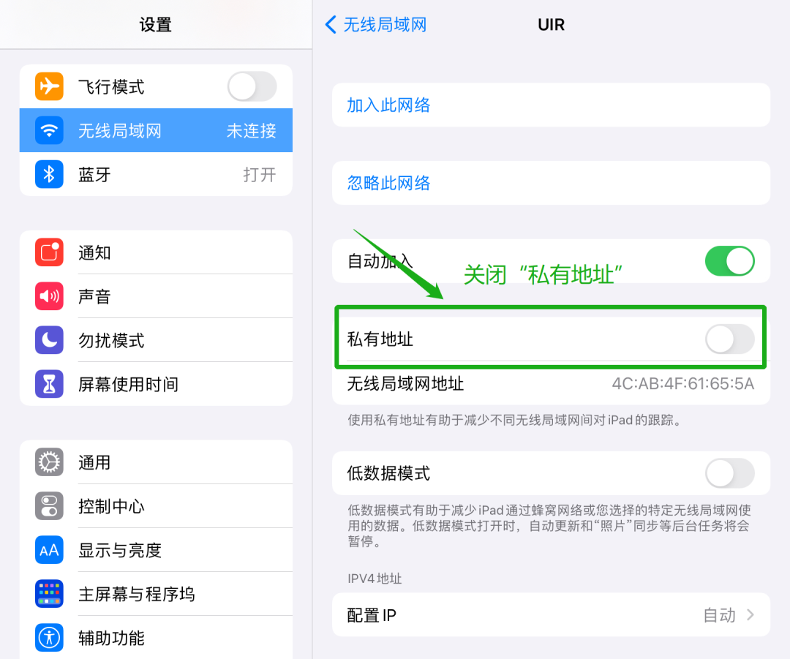

# 常见问题问答

## Q1: 设备被挤下线怎么办？

这是因为您已经接入了两台无线设备，无法再连入新设备。如果您没有同时使用3台设备还出现了这种情况。可能是因为有的设备开了无感认证，可以自动连接校园网，无需登录。这时输入网址[172.21.1.16](http://172.21.1.16)，登录后关闭**本机无感认证**即可。**上网设置**里可以看到所有无感认证设备，也可以在那里面进行关闭。

有时候连接了校园网又开了无感认证，可能会出现打不开网址[172.21.1.16](http://172.21.1.16)的情况，您可以输入网址[172.21.1.15:8080](http://172.21.1.15:8080)进入校园网自助服务界面，登录后**解绑设备**来关闭无感认证。（具体操作同下一问题）

## Q2: 无法打开页面，认证失败怎么办？

您可以尝试设备解绑操作。登录[172.21.1.15:8080](http://172.21.1.15:8080)进入校园网自助服务界面，登录后点击**网络信息**，可以看到若干条绑定记录，全选后点击**解绑设备**，之后重新认证即可。（30天内只可解绑一次）

## Q3: 校园网登录界面出现“当前使用的源IP与设备重定向地址中用户IP不一致，请重新验证”的提示怎么办？

请**不要**直接打开以前保存的登录认证页面。您需要关闭浏览器后，重新打开浏览器**手动输入**网址[172.21.1.16](http://172.21.1.16)，再进行登录即可。

如果是收藏夹访问，请将保存的网址中**http://172.21.1.16**之后的**所有内容**删去

## Q4: 苹果系统设备访问172.21.1.16显示无法访问怎么办？

您可以尝试在网络设置界面关闭随机mac地址再访问网址[172.21.1.16](http://172.21.1.16)。如下图连接校园网后，进入网络详情界面，关闭私有地址。

