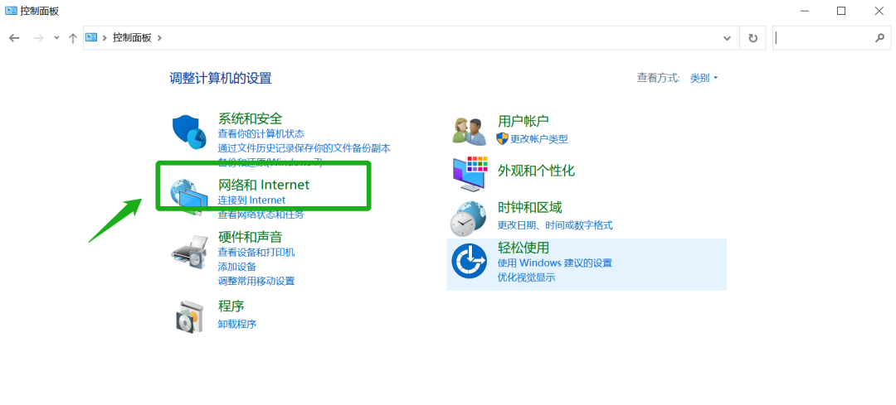

#校园网的连接

!!! note "写在前面"
    每个同学最多只能同时将3个设备（**2个无线+1个有线**）接入校园网！

## 无线网的连接

1. 在学校无线覆盖区域内，选择UIR或UIR_5G连接。
2. 连接后会自动弹出登录界面。在登录界面中输入用户名和密码，如果没有改过密码，**用户名和密码都是学号**。如果没有弹出校园网登录界面又上不了网，可以在浏览器中输入[172.21.1.16](http://172.21.1.16)网址，再进行登录。

## 有线网的连接

### 准备工作

在开始配置之前，请先前往**学交一楼值班室**询问宿舍的网络ip地址等信息。其中1-6对应宿舍内A-F接口

!!! note "示例"
    图示中列对应为：宿舍楼，宿舍号，接口号，ip地址，子网掩码，默认网关，DNS地址

### 连接网络

1. 插入网线后，打开**控制面板**点击**网络和Internet**

2. 点击**网络和共享中心**

3. 点击**更改适配器设置**

4. 右键单击**以太网**，点击**属性**

5. 在**Internet协议版本4**前打上对号并双击

6. 输入获得的ip地址等五项数字串，点击确认后退出
